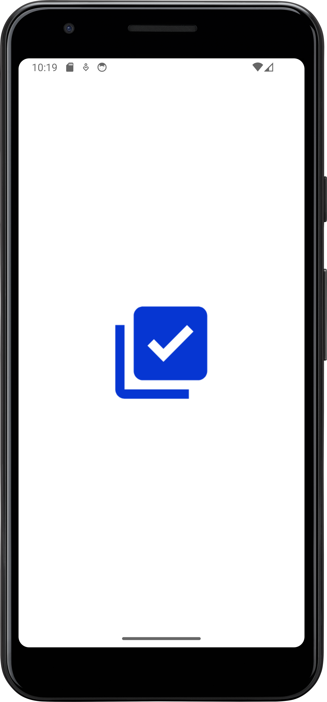
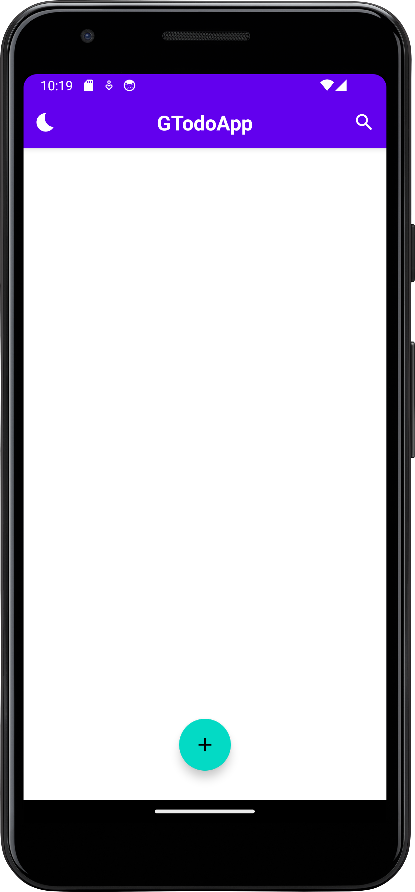
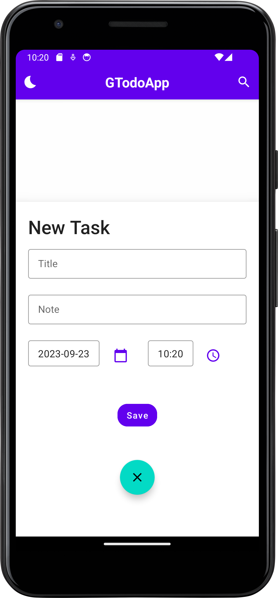
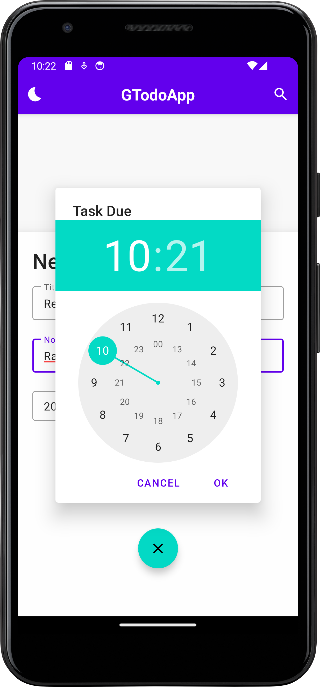
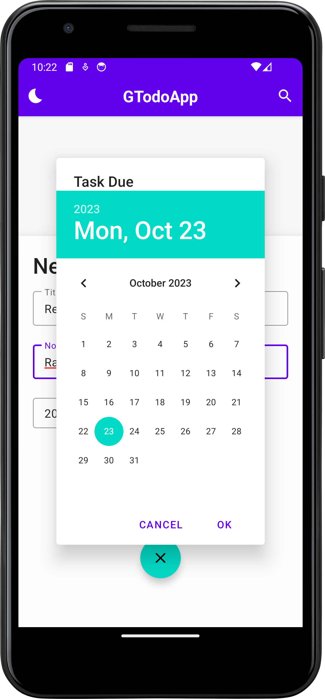
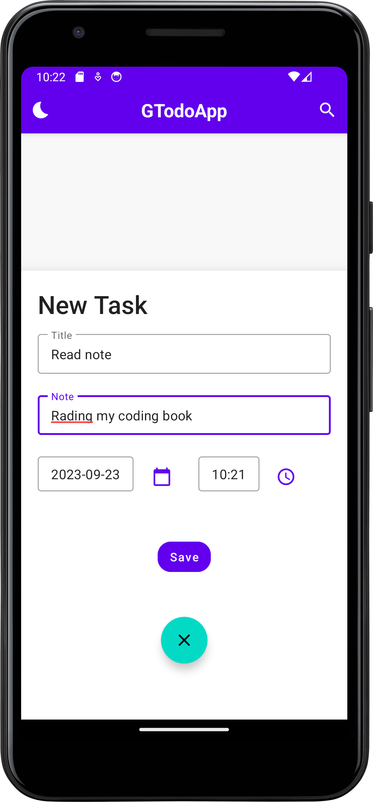
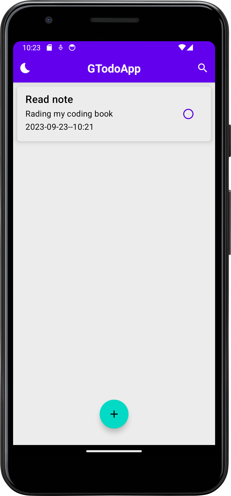
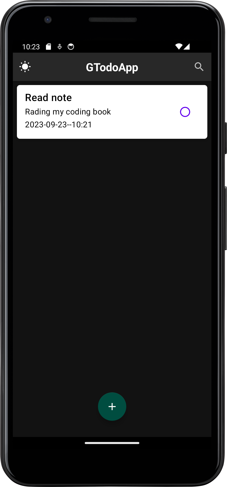
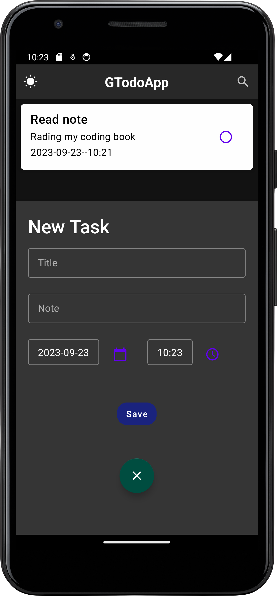

# JTodoApp
A simple Todo App

## Overview
JTodoApp is a simple and elegant app that helps you manage your tasks with ease. You can add, edit, and delete tasks, mark them as completed, and view them in a clean and user-friendly interface. You can also switch between a light (day) and dark (night) theme to suit your mood and preference. The app is 100% free to download and play with no in-app purchases or deposits.

## Screenshots








### Dark Theme mode

Initiating the dark theme mode
<div></div>



## Getting Started
To get the app up and running, follow these steps:

- Clone this repository to your local machine.

```bash
git clone https://github.com/JamesHardey/JTodoApp.git
```

- Open the project in your preferred Android development environment (e.g., Android Studio).
- Build and run the app on your Android emulator or physical device.
- Start managing your tasks with the day-night theme toggle!

## Day-Night Theme Toggle
The app's day-night theme toggle is located in the settings or preferences section. It allows you to switch between the light and dark themes according to your preference.

## Contributing
Contributions are welcome! If you'd like to contribute to this project, please follow these steps:

- Fork the repository.
- Create a new branch for your feature or bug fix.
- Make your changes and commit them.
- Push your changes to your fork.
- Create a pull request to merge your changes into the main repository.

## License
This project is licensed under the MIT License.

## Acknowledgments
This app was created with love by **JamesHardey**.

Special thanks to the Material Design team for providing design guidelines and inspiration.

## Contact
If you have any questions or feedback, feel free to reach out to us:

- Email: jamesade646@gmail.com

Happy task managing with our Todo app! 🚀

I hope you like it! Let me know if there's anything else I can do for you. 😊